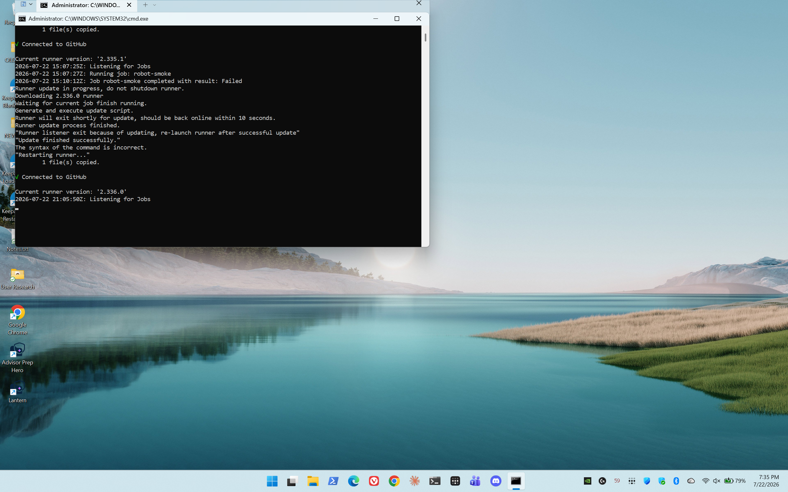
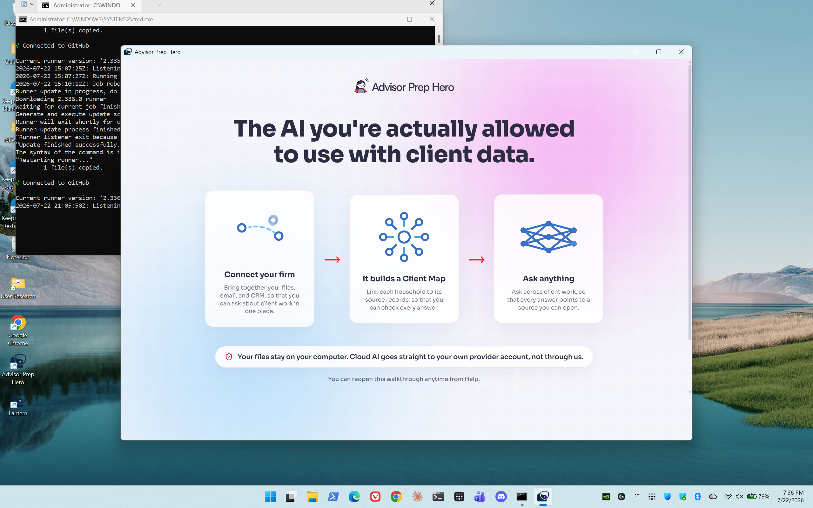
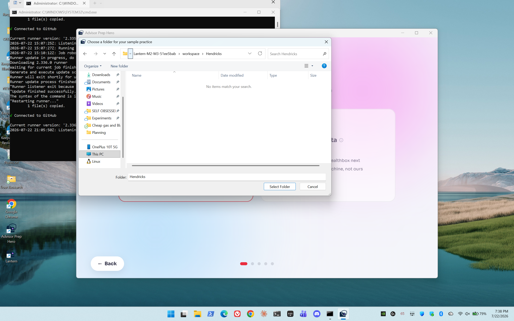
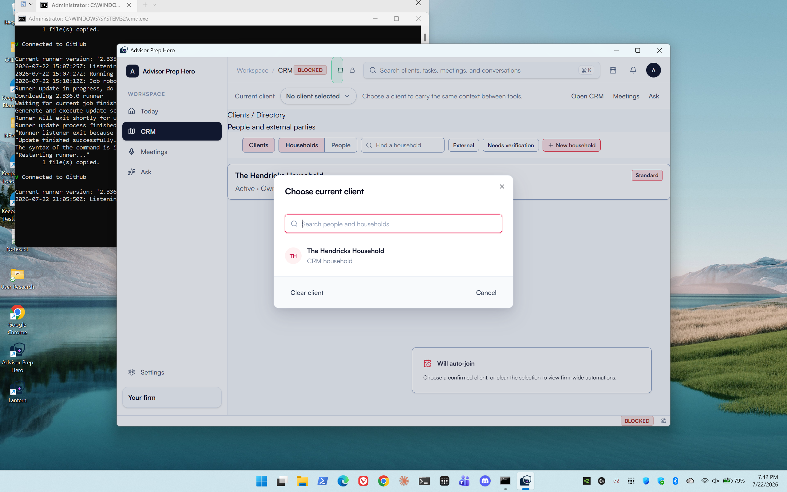
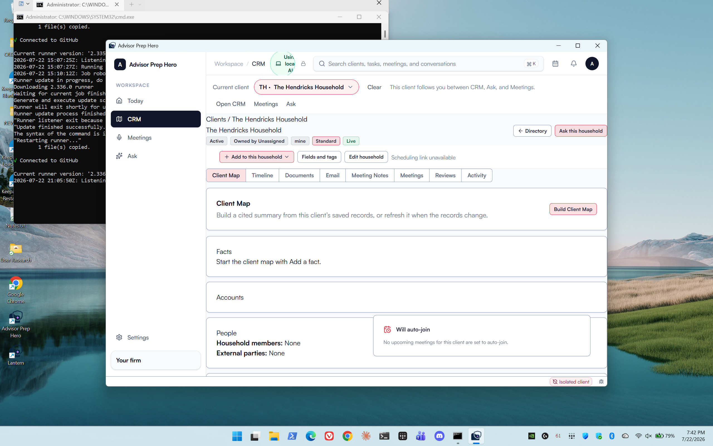
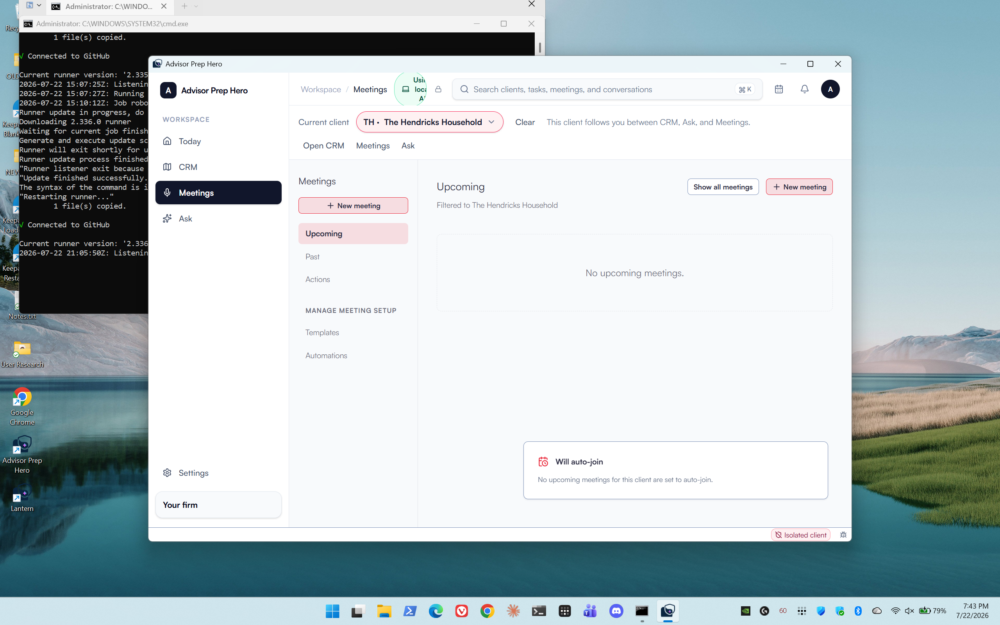
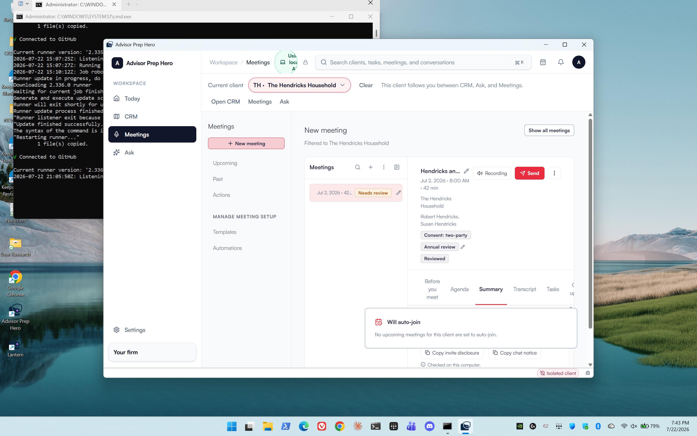
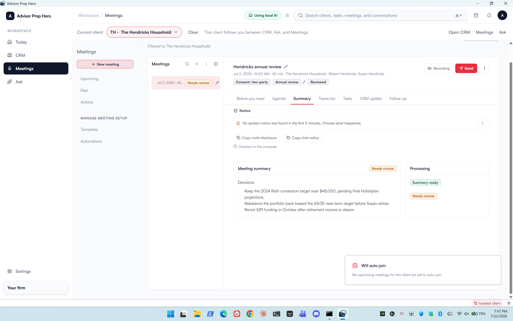
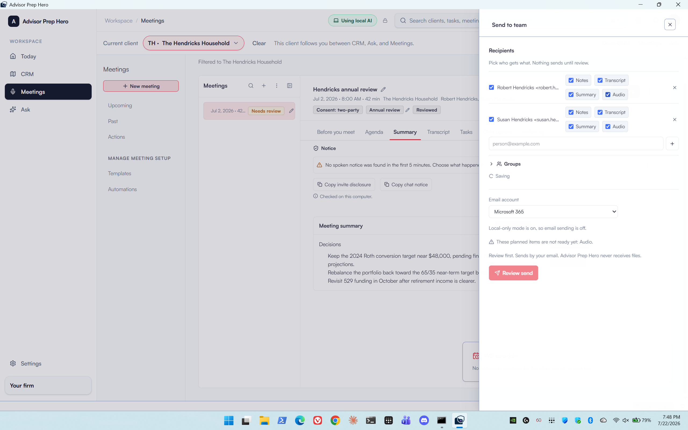

# Screenshot gallery

| Step | Evidence |
| --- | --- |
| Clean prelaunch desktop |  |
| Fresh workspace onboarding |  |
| Native picker on exact folder |  |
| Real client chooser |  |
| Hendricks selected |  |
| Meetings shell |  |
| Real row detail stays open |  |
| Seeded meeting summary |  |
| Send drawer enters Saving |  |
| First honest blocker remains |  |

The final two captures are separate observations. They show that the drawer did not settle or advance to the review screen; no send occurred.
