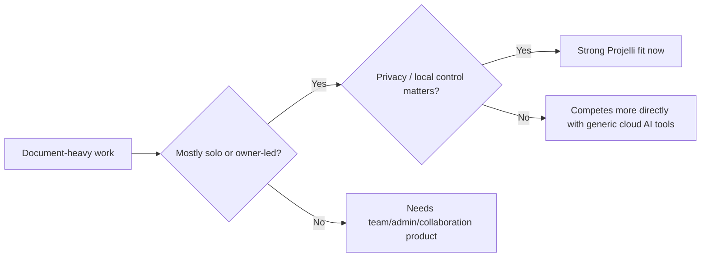
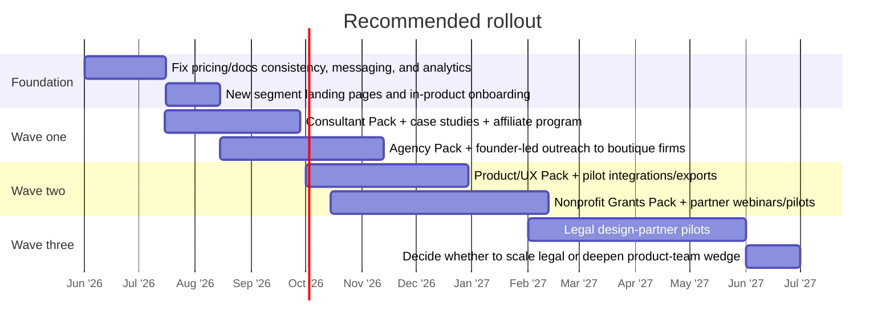

# Projelli Market Pivot Assessment

## Executive Summary

Projelli’s strongest current wedge is not “teams” in the broad SaaS sense. It is **high-value, document-heavy, privacy-sensitive knowledge work done by one person or a very small pod**: work where the user wants AI help, but does **not** want the work product trapped in a cloud conversation thread or proprietary database. The product already has a compelling bundle for that job: every chat becomes a local Markdown file; the app can use Claude, OpenAI, Gemini, or Ollama via BYOK; it supports image and PDF chat, local RAG over workspace files and PDFs, audit logging, multilingual UI, community templates/plugins, Office-file handling, and local TTS. At the same time, Projelli explicitly does **not** position v1 as a real-time collaborative/team workspace, and its current mobile story is reader-first via synced folders rather than a full mobile app. citeturn4view0turn6view0turn6view1turn6view6turn11view0turn10view0

Because of that, the best pivot is **away from “indie founders” as a psychographic** and toward **professional niches with founder-like workflows**: people who write strategy docs, interview syntheses, proposals, briefs, and client-facing deliverables, often alone, often under NDA, and often with poor tolerance for cloud sprawl. The highest-confidence target markets are: **independent consultants and fractional operators**, **boutique agencies**, **in-house product and UX research teams in SMB/mid-market software companies**, **nonprofit grant and development teams**, and **solo/small-firm legal teams as a later, more selective wedge**. citeturn16view1turn24search8turn34view0turn16view5turn16view2turn39view0turn39view5turn39view2

The main commercial implication is that **Projelli is currently underpriced for business use cases**. Public benchmarks show adjacent tools charging roughly **$15–$25 per user per month** for general AI/team productivity and much more for vertical workflows: Notion Business is **$20/seat/month**, ChatGPT Business is **$25/user/month** when billed monthly, Claude Team standard seats are **$20/member/month** annually, Dovetail’s updated Professional plan is **$15/user/month**, Grain lists **$15** Starter and **$29** Business, Instrumentl starts at **$299/month**, Grantable at **$50/$150 per month**, and Clio starts at **$49/user/month** before AI add-ons. By contrast, Projelli’s public pricing anchors it at **$49 one-time** for Pro and **$99 lifetime**, which is excellent for indie adoption but too low for serious B2B monetization. citeturn31view2turn38view1turn37view1turn34view0turn27search2turn32view0turn31view8turn31view9turn31view7turn5view2

The recommendation is to keep the current founder/indie offer as a self-serve base, but add a **business line of packaging and annual pricing** built around vertical workflow packs, support, and update rights. In practical terms: **Wave one** should target consultants and agencies; **wave two** should expand into product/UX teams and nonprofit grants; **wave three** should test a legal pilot once Word/DOCX/redline/citation workflows are stronger. Healthcare, government, and large operations-heavy sectors should be deferred until Projelli has stronger compliance packaging, admin controls, and vertical integrations. citeturn10view0turn25search5turn25search9turn26search12turn26search1

| Recommended priority | Why it fits now | Revenue shape | Recommendation |
|---|---|---|---|
| Independent consultants and fractional operators | Closest match to current product: solo, doc-heavy, privacy-sensitive, fast buying; management analysts are a 1.1M-job U.S. occupation and 14% are self-employed. citeturn16view1turn16view0 | Fastest self-serve revenue; strong likelihood of $0.5M+ annualized revenue if you can win a few thousand seats at business pricing. | **Pursue first** |
| Boutique agencies | Same document pattern, plus client confidentiality and reusable templates; agency/consulting revenue pools are large. citeturn24search8turn24search0turn24search2 | Good seat expansion inside firms, moderate founder-led sales. | **Pursue first** |
| In-house product and UX teams | Strong workflow fit for interviews, syntheses, competitor analysis, PRD-like docs; large seat pool in PM/research roles. citeturn16view5turn16view2 | Larger long-term upside, but more integration pressure. | **Pursue second** |
| Nonprofit grant and development teams | Clear “proposal memory” problem; many nonprofits and high incumbent prices. citeturn39view0turn39view1turn39view5turn32view0turn31view8turn31view9 | Smaller ACV than legal, but accessible and differentiated. | **Pursue second** |
| Solo/small-firm legal teams | Very high WTP and privacy fit, but needs more product hardening and compliance messaging. citeturn39view2turn39view3turn33view3turn30view4turn25search4turn25search8 | High ACV, slower sales, higher product burden. | **Pilot later** |

## Projelli Today

At its core, Projelli is a **local-first desktop AI workspace**. The product promise is unusually crisp: every AI conversation becomes a Markdown file in a folder on the user’s machine; users can open those files in Finder/Explorer or third-party editors; AI calls go directly from the user’s device to Anthropic, OpenAI, Google, or a local Ollama instance; and Projelli does not sit in the middle of inference or keep user content on its servers. That positioning is reinforced across the homepage, FAQ, privacy policy, getting-started docs, and comparison pages. citeturn4view0turn6view1turn8view0turn8view1turn9view1turn9view2turn4view5turn4view6

The feature set is already broader than the “AI notebook” label implies. Public materials show: real local files; full-text search; wiki-links and backlinks; split-pane editing; research/source cards and citation workflows; whiteboard; audio capture/transcription; versioning and audit logs; image attachments in chat; PDF chat plus on-device PDF indexing; long-context compression; local TTS via Piper; community templates and plugin marketplaces; sandboxed plugin permissions; browser demo mode; Office-file handling for Word, Excel, and PowerPoint; and English, Spanish, and German UI. Those are meaningful capabilities for professional knowledge workflows, not just founder ideation. citeturn6view0turn6view1turn6view4turn6view6turn11view1turn3view4turn3view5turn9view5

The product’s **current strengths** for a pivot are clear. First, privacy and data control are a real differentiator: files stay local, API keys live in OS keychains, and the privacy policy says the only routine app-server contact is license validation plus opt-in telemetry/crash reporting. Second, Projelli’s **document-memory model** is strong: chat becomes file, file becomes retrievable context, PDFs can join the index, and the user can keep their archive in ordinary sync folders like iCloud Drive, Dropbox, Syncthing, Google Drive, or OneDrive. Third, the product already has the beginnings of a verticalization engine via templates, plugins, and marketplace submissions. citeturn9view2turn8view1turn11view0turn9view0turn11view1turn3view4turn3view5

The **current constraints** are just as important. Projelli’s own FAQ says that a future “Projelli for Teams” would likely be a **separate product**, because real-time collaboration, multi-user permissions, and team accounts are a different problem and price point. The comparison page against Notion says real-time collaboration is not the goal, and mobile today is mainly a read workflow via synced folders while a dedicated mobile reader is still coming. That makes broad enterprise workspace replacement the wrong near-term pitch. citeturn10view0turn4view6turn11view0

There is also a **pricing/packaging inconsistency in public materials** that should be fixed before a market pivot. The homepage presents a **30-day full-feature trial**, then a Pro license for **$49 one-time** and Lifetime for **$99**. The FAQ and Terms, however, describe a **perpetual free tier** with one AI provider, three templates, and one workspace. Those are not the same motion, and B2B buyers will notice the ambiguity. Resolve this first. citeturn5view2turn10view1turn9view3turn9view4

The practical market filter looks like this:



That filter is why the best targets are not “all SMBs” or “all product teams.” They are **specific roles inside SMB and service businesses whose work already looks like Projelli’s native shape**. citeturn4view0turn10view0turn11view0

## Market Segment Universe

I screened the adjacent markets against five criteria: **workflow fit to today’s product**, **privacy/local-first relevance**, **willingness to pay**, **integration/compliance burden**, and **go-to-market tractability**. I used U.S. occupation and sector counts as TAM proxies where possible, and industry revenue as a proxy where seat counts are less clean. Those proxies are directional rather than exact, but they are sufficient to rank the segments. citeturn16view0turn16view1turn16view2turn16view5turn39view0turn39view1turn39view2turn19view1

```text
Modeled annual seat-value TAM proxies
Legal practitioners              ~$822M   ██████████
Product / UX workflow seats      ~$583M   ███████
Consultant workflow seats        ~$258M   ███
Higher-ed faculty / researchers  ~$170M   ██
Grant-writing workflow seats     ~$24–29M █
```

These modeled seat-value proxies use cited U.S. occupation counts and simple annual price assumptions discussed later in the report; agency TAM is better expressed as an industry-revenue proxy because public seat counts are less clean. citeturn16view0turn16view2turn16view5turn39view2turn19view1turn16view4turn39view5

| Segment | Primary use cases and pain points solved | Market size proxy | WTP indicators | Likely buyer and decision path | Competitive landscape and constraints | Priority |
|---|---|---|---|---|---|---|
| **Independent consultants and fractional operators** | Client discovery notes, proposals, competitive analysis, strategy memos, meeting syntheses, reusable deliverable templates; pain points are context re-entry, fragmented notes, and client-confidential AI work. | U.S. management analysts: **1,075,100 jobs in 2024**, with **14% self-employed**; management consulting services generated **$307.3B** in 2022 employer-firm revenue. citeturn16view0turn16view1turn24search8 | Adjacent AI work tools cluster at **$20–$25/user/month**: Notion Business **$20**, ChatGPT Business **$25 monthly**, Claude Team **$20 annually**. citeturn31view2turn38view1turn37view1 | Usually owner-buyer. One person trials the product and decides in days, not quarters. | Competitors: Notion, ChatGPT, Claude, Obsidian-like local tools. Projelli differentiates on local files, BYOK, PDF/image RAG, auditability. Main constraint is onboarding friction from BYOK and the need for polished deliverable/export workflows. citeturn4view0turn6view6turn4view5turn4view6 | **Very high** |
| **Boutique agencies** | Multi-client research, messaging docs, content briefs, interview syntheses, account strategy, proposal drafting; pain points are client-data sprawl and weak reuse across projects. | Best available proxy is industry revenue: management consulting **$307.3B**, advertising agencies **$63.8B**, public relations agencies **$19.7B** in 2022 employer-firm revenue. citeturn24search8turn24search0turn24search2 | Dovetail’s updated Professional plan is **$15/user/month**, Grain lists **$15 Starter** and **$29 Business**, Notion Business is **$20/seat/month**. citeturn34view0turn27search2turn31view2 | Agency owner, head of strategy, research director, or account lead; usually 2–10 seat pilots. | Competitors: Dovetail, Grain, Notion, ClickUp/ChatGPT in practice. Gap: Projelli lacks team/admin and multi-client management polish; opportunity: become the “private client-work copilot” rather than a general PM suite. citeturn34view0turn30view1turn27search2 | **High** |
| **In-house product and UX teams** | Interview repositories, user research synthesis, competitor analysis, pricing and GTM memos, PRD/brief drafting, evidence-backed strategy docs; pain points are context loss and cloud-AI leakage. | U.S. project management specialists: **1.0M jobs**; market research analysts: **941,700 jobs**. citeturn16view5turn16view2 | Dovetail Professional **$15/user/month**; Grain **$15/$29**; Notion Business **$20**; ChatGPT Business **$25 monthly**. citeturn34view0turn27search2turn31view2turn38view1 | PM, research lead, design ops, or PMM champion; starts as single-seat or small-team wedge, then expands. | Competitors: Dovetail for repository/research ops, Grain for meetings, Notion/ChatGPT/Claude for drafting. Constraint: buyers will expect imports/exports and integrations to Jira/Linear/Figma/Slack. Projelli should not position as the team system of record yet. citeturn30view1turn27search2turn35view0turn37view1 | **High** |
| **Nonprofit grant and development teams** | Boilerplate memory, RFP/PDF extraction, proposal drafting, grant calendars, donor/funder research notes, board updates; pain points are repetitive rewriting and scattered institutional knowledge. | U.S. social sector has **1,935,344 registered nonprofits**; **1.2M 501(c)(3)s**; fundraisers held **134,400 jobs** in 2024; **80,000+** 501(c)(3) nonprofits reported government grants annually from 2021–2023. citeturn39view0turn39view1turn16view4turn39view5 | Instrumentl is **$299/$499/$999 per month**; Grantable is **$50/$150 per month** and discounts small nonprofits to **$25/$75**; OpenAI offers nonprofits up to **75% discount** on ChatGPT Business/Enterprise. citeturn32view0turn31view8turn31view9turn29search9turn37view0 | Development director, grant writer, or consultant; buying is often budget-sensitive but ROI-driven and can close quickly when tied to a live grant calendar. | Competitors: Instrumentl, Grantable, generic ChatGPT/Notion stacks. Opportunity: lower-cost, local-first “institutional memory for proposals.” Constraints: nonprofit CRM/date workflows matter; current template pack is founder-heavy. citeturn32view0turn29search11turn29search17 | **Medium-high** |
| **Solo and small-firm legal teams** | Matter notes, clause playbooks, first-pass document review, intake synthesis, research memos, timeline extraction from PDFs; pain points are confidentiality and repetitive drafting. | ABA counts **1.37M** lawyers in the U.S. in 2025; BLS counted **864,800** lawyer jobs in 2024, with **12% self-employed**. citeturn39view2turn16view3 | Clio starts at **$49/user/month** and sells AI as an add-on via sales; Spellbook targets law firms and in-house teams, emphasizes security/privacy, and says it is used by **4,500+ legal teams**. citeturn31view7turn33view3turn30view4 | Managing partner, practice lead, legal ops, or tech committee; slower evaluation, heavier security review. | Competitors: Clio, Spellbook, Harvey-class enterprise legal AI. Constraints are real: ABA Formal Opinion 512 highlights competence, confidentiality, client communication, and fee implications for generative AI use. Word/DOCX fidelity and legal-source traceability are table stakes. citeturn25search4turn25search8turn30view4 | **Medium** |
| **Higher-education faculty and research labs** | Literature review notes, grant drafts, interview notes, teaching prep, long-form writing and PDF libraries; pain points are fragmented documents and privacy around research files. | Postsecondary teachers held **1.4M jobs** in 2024. citeturn19view0turn19view1 | Notion offers education/free student positioning, and OpenAI offers ChatGPT Edu or teacher plans, which increases price pressure. citeturn27search20turn37view0 | Principal investigator, faculty member, lab manager. Decisions can be individual but institutional sales are slow. | Competitors: Notion, ChatGPT Edu, NotebookLM/Zotero/Obsidian ecosystems. Constraint: FERPA and student-record privacy if student data enters the workflow. citeturn25search18turn25search2 | **Medium-low** |

I would **deprioritize healthcare, government, and broad field-ops categories** for the next 12 months. Healthcare use cases involving ePHI require risk analysis and appropriate BAAs when cloud services are involved; federal buyers face formal cloud authorization and accessibility obligations; and Projelli’s public docs emphasize a desktop, local-first, BYOK document workspace rather than the admin, procurement, and systems-integration posture those sectors usually require. citeturn25search5turn25search9turn26search12turn26search21turn26search1turn4view0turn10view0

## Recommended Target Markets

**Independent consultants and fractional operators should be your first pivot target.** This segment already behaves like your founder audience, but it is larger, less identity-bound, and more monetizable. The product’s current architecture solves their exact problem: confidential strategy work scattered across AI chats, docs, and PDFs, with repeated re-contextualization. Your differentiator here is not “AI writing.” It is **client-work memory on your own machine**. The market is large enough to matter, and the willingness to pay is validated by adjacent tools charging ongoing monthly rates far above Projelli’s current price. citeturn16view1turn24search8turn31view2turn38view1turn37view1turn4view0turn11view1

For this segment, the **core use cases** are proposals, strategy briefs, discovery-call synthesis, workshop output, competitive landscapes, and reusable consulting templates. The **key pain you solve** is that the consultant’s “thinking OS” becomes searchable, reusable, and private. The likely buying motion is straight self-serve or founder-assisted self-serve. Acquisition should center on **LinkedIn case-study content, consultant newsletters, YouTube walkthroughs, affiliate creators, and template-led SEO** around deliverables like “client debrief template,” “strategy memo,” “competitive teardown,” and “weekly client update.” The main product tweak needed is a **Consulting Pack**: workspace presets, a client-switcher-friendly home screen, proposal/export polish, and a small library of consultant-grade templates. Those are well within the current product shape. citeturn12search0turn6view0turn6view4turn11view1

**Boutique agencies are the second-best target.** Agencies share the same document-heavy pattern as consultants, but with modest seat expansion and clearer client confidentiality pressure. Projelli can win if it is framed as the **private drafting and research cockpit for client work**, not the system of record for agency operations. The market proxy is strong: consulting, advertising, and PR together represent very large revenue pools, and adjacent agency-facing tools like Dovetail and Grain already normalize ongoing per-seat spend. citeturn24search8turn24search0turn24search2turn34view0turn27search2

The agency use cases are strategy docs, campaign messaging, interview synthesis, pitch materials, research repositories, and content briefs. The **big feature gap** is not AI quality; it is **multi-client packaging**. You will need an **Agency Pack**: easier workspace switching, reusable firm templates/playbooks, shared asset packs, stronger exports, and some light account-level administration. You do **not** need full real-time collaborative editing to begin; you need an agency principal to feel that Projelli reduces the risk of staff using unmanaged ChatGPT tabs on confidential client files. A founder-led outbound motion to small agencies, plus partner/referral programs with agency coaches and freelance collectives, should work well. citeturn10view0turn9view2turn34view0

**In-house product and UX teams are the third priority, but the positioning matters.** Projelli should not try to replace Dovetail, Notion, or Jira. It should position as a **private evidence-to-document workspace** for PMs, UX researchers, PMMs, and strategy leads: the place where interviews, screenshots, PDFs, pricing notes, and competitor research get turned into sharp internal documents. This is a large adjacent seat pool, and the current product already supports many of the underlying tasks. citeturn16view5turn16view2turn6view6turn11view1

What product teams need beyond today’s base product are **workflow bridges**: better transcript import, clickable source-backed synthesis, PRD/brief templates, and clean exports or plugins for Jira/Linear/Figma/Slack. The commercial motion should be a **champion-led pilot**: start with one PM or researcher, then expand to a 5–15 seat team if activation and reuse are strong. The competitor set is more intense here—Dovetail, Grain, Notion AI, ChatGPT Business, Claude Team—but Projelli’s differentiation is sharper than it first appears: **on-device memory, real files, PDF/image context, and lower data-exposure anxiety**. citeturn30view1turn34view0turn27search2turn35view0turn37view1

**Nonprofit grant and development teams are the fourth priority and the best vertical use-case wedge.** This is the cleanest move from “founder workflows” to “repeatable professional workflows.” Grant teams live in long-form documents, boilerplate libraries, PDFs, deadlines, and repeated storytelling. They also suffer badly from institutional-memory loss when one grant writer leaves. Projelli’s local workspace plus RAG model is a strong fit—provided you ship a dedicated vertical template pack. The reason this segment is so attractive is that incumbent grant software is expensive, and the best-known vendors already educate the market on the ROI of better grant workflows. citeturn39view0turn39view5turn32view0turn30view3turn31view8turn31view9

To win here, build a **Grants Pack**: funder-fit memo, proposal boilerplate library, RFP checklist extraction, evaluation-plan draft, logic-model draft, board-ready progress update, and a grant calendar/deadline pack. Add a nonprofit discount and a consultant-friendly configuration later. Instrumentl and Grantable prove both willingness to pay and what customers expect; Projelli should undercut them on price and beat them on **privacy, portability, and long-form writing ergonomics**, not on grant-database depth. The right GTM is content plus partnerships: grant consultants, nonprofit accelerators, state nonprofit associations, and webinars showing “from PDF RFP to first draft in one workspace.” citeturn32view0turn29search17turn29search20turn29search9

**Legal is the best fifth market, but only as a pilot track after more product work.** The upside is obvious: lawyers are plentiful, highly paid, already spend on software, and are increasingly adopting AI. The privacy/local-first angle will resonate. But legal buyers will hold Projelli to a much higher bar than consultants or grant teams. ABA guidance makes clear that generative AI usage raises duties around competence, confidentiality, client communication, and billing. Meanwhile, legal incumbents foreground security/compliance and Word-native workflows. citeturn39view2turn15view2turn25search4turn25search8turn30view4turn33view3

That means legal should **not** be the first big pivot. It should be a **design-partner motion** with 5–15 boutique firms or in-house teams once you have: matter-based workspaces, stronger DOCX round-tripping, redline-aware outputs, citation/source pinning, and privilege-comfort messaging. If you do that, there is real revenue here; if you do not, you risk entering a high-WTP market with an underfit product and getting dismissed. citeturn30view4turn31view7turn39view3turn39view4

## Go-to-Market Design

The clearest pricing conclusion from the market is this: **keep the current founder pricing, but stop using it as the only pricing architecture.** Adjacent tools already normalize **$15–$25/user/month** for general AI work software, while vertical systems in grants and legal sit well above that. If Projelli remains only a $49-once consumer utility, you will leave the best-fit professional markets underserved and materially under-monetized. citeturn31view2turn38view1turn37view1turn34view0turn27search2turn32view0turn31view7

My recommendation is a **hybrid packaging model**. Keep the current indie/founder SKUs for continuity and word-of-mouth. Add a new line called something like **Projelli for Work** with annual pricing, business support, and vertical packs. Importantly, don’t sell “team collaboration” you do not have. Sell **private workspaces for professional deliverables**.

| Segment | Positioning | Suggested packaging and pricing | Sales motion | Best channels and partners | MVP feature adjustments |
|---|---|---|---|---|---|
| Consultants / fractionals | “Your private client-work AI workspace” | **$240/year** per seat or **$25/month**; include Consulting Pack, priority support, business-use updates | Pure PLG with founder assist for larger buyers | LinkedIn thought leadership, consultant newsletters, YouTube demos, affiliates, template SEO | Consulting Pack, client workspace presets, cleaner proposal/export flows |
| Boutique agencies | “The confidential drafting cockpit for client accounts” | **$300/year** per seat; 3-seat and 10-seat bundles; optional asset/template library add-on | PLG + founder-led sales for 5–25 seats | Agency coaches, fractional CMOs, RevOps/content agencies, webinar partnerships | Agency Pack, workspace switching, shared template packs, admin-lite billing |
| Product / UX teams | “Evidence-to-document workspace for PM, UX, and PMM” | **$300/year** per seat; 5-seat pilot bundle around **$1,250–$1,500** annual | Champion-led pilots, then small expansion | PM/UX newsletters, design communities, product podcasts, research consultants | Interview/research pack, source-backed syntheses, exports/plugins to Jira/Linear/Figma |
| Nonprofit grants | “Institutional memory for proposals and grants” | **$180–$240/year** per seat with **40% nonprofit discount**; org bundles for 3–10 seats | Self-serve + partner-led | State nonprofit associations, grant consultants, webinars, case-study content | Grants Pack, RFP/PDF checklist extraction, boilerplate library, calendar/deadline views |
| Legal pilot | “Local-first AI workspace for confidential drafting and review” | **Custom pilot**, likely **$600+/seat/year** once feature-ready | Founder-led design-partner sales only | Boutique firms, ALSPs, in-house legal ops contacts | Matter workspaces, source pinning, DOCX/redline improvements, permissioned export/reporting |

The messaging change should be just as explicit as the pricing change. Today the homepage says “built for indie founders, useful for anyone who works with AI on real projects.” For the pivot, I would move to a portfolio of segment-specific pages built around one core sentence: **“A local-first AI workspace for document-heavy professional work.”** Then create landing pages for consultants, agencies, product research, grants, and legal. The current comparison pages already show you know how to articulate category differences; apply that same style to new segment pages. citeturn4view0turn4view5turn4view6

There is also a strong **partnership strategy** hiding in the product. Because Projelli already supports plugins and community templates via public GitHub repos, you can create a low-cost ecosystem for vertical packs and co-marketed workflows. This is especially strong for consultants, agencies, and nonprofits, where a respected practitioner-created template bundle can sometimes outperform a long feature launch. In other words, use the marketplace not just as a product feature, but as a GTM surface. citeturn3view4turn11view1

## Rollout Timeline and KPIs

Your next year should be run as a **three-wave wedge strategy**, not a broad repositioning.



A recommended milestone plan:

| Time horizon | What should be true | KPIs that matter |
|---|---|---|
| **Ninety days** | Public pricing is consistent; consultant and agency positioning pages are live; first vertical pack exists; analytics cleanly distinguish browser-demo, download, trial, activation, and paid conversion. | Website-to-trial conversion, trial-to-paid conversion, first-week activation rate, number of template runs per activated user, percentage of paid users using 2+ workspaces |
| **One hundred eighty days** | Consultants and agencies are established as your first business wedge; PM/UX pilot motion exists; 10–20 design partners across the top three segments; business plan/pricing has been validated. | Paid seats by segment, payback period on creator/affiliate spend, monthly active paid users, retention at day 90+, average workspaces per account, percentage of accounts using PDFs/RAG/templates |
| **Three hundred sixty-five days** | You have one strong PLG wedge, one strong founder-led wedge, and one promising vertical wedge; legal has enough signal to continue or stop. | ARR-like annualized run rate from “for Work” plans, expansion revenue, segment-level CAC, segment-level gross retention, template marketplace installs, pipeline-to-close rate for founder-led deals |

The KPIs that matter most for this product are **activation and repeat behavior**, not raw downloads. Projelli wins when a user moves from “one interesting AI session” to “my actual work now lives here.” So measure behaviors that reflect operating-system status: number of files created from chat, number of linked documents, rate of PDF index usage, rate of template reuse, number of distinct workspaces, and whether a user returns to edit an AI-created file. Those are much better leading indicators than simple MAU. This is consistent with the product’s own “every chat becomes a file” and workspace-memory thesis. citeturn6view0turn6view1turn11view1

## Open Questions and Limitations

This assessment is high-confidence on **where Projelli fits best** and lower-confidence on **exact segment sizing beyond the cited U.S. proxies**. Several market-size estimates here use occupation counts or sector-revenue proxies rather than exact category TAM, because that is the best public evidence readily available without proprietary market databases. citeturn16view0turn16view2turn16view5turn39view1turn24search8

Two product/market questions should be answered quickly with design-partner interviews before heavy build-out. First: **how much BYOK friction business users will accept** outside the privacy-sensitive niches. Second: whether buyers want Projelli primarily as a **personal confidential workspace** or also expect **light team features** such as shared template packs, centralized billing, or read-only sharing. Projelli’s public docs are clear that a full team product is a separate problem, so this distinction matters. citeturn8view1turn10view0

There is also one material documentation issue to fix immediately: the public pricing pages are inconsistent between **30-day full-feature trial** and **perpetual free tier with limited features**. That kind of ambiguity will hurt trust with business buyers and channel partners. citeturn5view2turn10view1turn9view3turn9view4

Finally, legal should be treated cautiously because public competitor pricing is often opaque and because the compliance bar is much higher than in consultants, agencies, product teams, or nonprofits. Spellbook’s public materials emphasize security and privacy, but not simple self-serve pricing; Clio’s legal AI add-ons are routed through sales; and the ABA’s generative-AI guidance means the product needs stronger workflow-specific safeguards before a serious legal push. citeturn30view4turn33view3turn25search4turn25search8