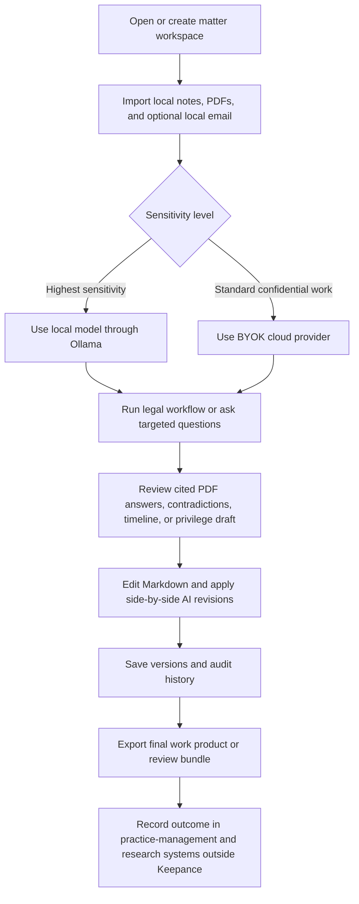

# Keepance Review From a Senior Attorney Perspective

## Executive summary

Keepance is publicly positioned as a **local-first desktop AI workspace** for attorneys, tax professionals, consultants, and advisors. Its core promise is architectural rather than merely contractual: your workspace files remain on your machine, your API key is stored in the OS keychain, and prompts go directly from your device to the model provider you choose instead of through Keepance’s servers. It also offers a local-model path through Ollama, which Keepance describes as the route where nothing leaves the machine at all. Public materials further show PDF chat, local PDF indexing/RAG, wiki-links, backlinks, full-text search, version history, audit logging, plugins, MCP support, and a legal practice pack marketed as 18 attorney workflows. citeturn3view0turn11view0turn14view0turn24view2turn25view1turn22view1

From an attorney’s practical perspective, **Keepance looks strongest as a private drafting-and-analysis sidecar**, especially for solo and small-firm lawyers doing confidential writing, issue spotting, deposition analysis, timeline building, intake synthesis, and early-stage strategy work. The public record supports that use case. It does **not** look like a replacement for a law firm’s system of record, document management platform, practice management suite, or legal research platform. Keepance’s own comparison pages repeatedly say it “sits beside” Clio and CoCounsel rather than replacing them; it does not claim to know matters, billing, deadlines, or perform Westlaw-grounded, citation-validated research. citeturn34view0turn35view0turn11view0

The product’s biggest legal-operations strengths are its **privacy architecture, portability, and low price**. Public pricing is straightforward on the current site: Personal at $49 one-time, Professional at $149/year including one practice pack, and Practice at $499/year for up to five seats, plus separate AI-provider costs under a BYOK model. The app offers a 30-day trial without a card or account, and the site says moderate solo AI use often adds roughly $5–$15 per month depending on provider and usage. citeturn3view0turn6view0turn11view0turn37view0

The product’s biggest weaknesses for legal practice are **collaboration, integration depth, evidence-grade controls, and public-governance maturity**. Public sources say real-time collaboration is not part of the product and may never come to v1; the Practice tier gives up to five seats, but each user installs locally and files remain on each person’s machine. Public sources also do not document native connectors for Clio/MyCase/Litify, Relativity/Everlaw/Reveal, court e-filing systems, or mainstream document-automation suites. Instead, Keepance emphasizes local folders, plugins, and MCP for external connectivity. citeturn8search9turn6view0turn24view0turn15view0

A further concern is **documentation inconsistency**, which matters to law firms evaluating vendor reliability. The current website, EULA, FAQ, roadmap, changelog, GitHub repository, and download page are not fully aligned on pricing, licensing, version numbers, telemetry, Linux support, and perpetual-versus-annual rights. For example, the FAQ says Personal includes “all templates” and describes Practice as perpetual, while the homepage and EULA say Professional includes one practice pack and Practice is annual. The download page lists v2.1.3, while the public GitHub repo shows v2.4.1 released on June 6, 2026. The FAQ also says there is “no remote kill switch,” while the EULA and privacy policy describe weekly license validation against Keepance’s license server. citeturn15view0turn3view0turn6view2turn7view0turn19view0turn37view0

My bottom-line attorney assessment is this: **Keepance is worth a controlled pilot for confidential drafting and analysis in a solo or very small-firm setting, but not yet as a primary legal platform**. If your highest priority is keeping sensitive client work off a workspace vendor’s servers, Keepance’s public architecture is unusually attractive. If your priority is enterprise vendor assurance, deep law-firm integrations, collaborative matter management, or evidence-chain rigor, the public record suggests it is not yet ready to carry that burden alone. citeturn3view0turn11view0turn34view0turn35view0turn23view0turn7view0

## Product profile and public record

Keepance presents itself as a **desktop application** rather than a browser-first SaaS. The official site says files live in any folder the user chooses, AI requests go directly to Claude, GPT, Gemini, or Ollama, and the app works offline except for AI calls themselves. The tour page describes the core loop as: ask a question, receive a reply, and save the conversation as a permanent Markdown file on the hard drive. Official documentation also shows version tracking, diffs, trash recovery, wiki-links, backlinks, and full-text search. citeturn3view0turn36view0turn14view0turn22view1

Publicly documented features now include **multimodal image input, PDF chat, local PDF indexing/RAG, long-chat compression, read-aloud via a local Piper sidecar, a plugin system, a community templates marketplace, MCP support, side-by-side AI editing, voice input, basic Office-file support, and cost tracking**. The roadmap and changelog show those features shipping largely across April and May 2026, while the GitHub repository indicates an active release cadence. citeturn24view2turn25view0turn25view1turn25view2turn19view0

For attorneys specifically, the main official page markets an **18-template legal practice pack** including a Deposition Contradiction Finder, Evidence Gap Analyzer, Privilege Log Drafter, Case Timeline Builder, Client Intake Synthesizer, Discovery Document Triage, Patent Disclosure Draft, Contract Review Checklist, Transactional Matter Summary, and Estate Planning Client Summary. The tour page highlights a smaller sample of attorney workflows, emphasizing contradictions, evidence gaps, privilege logs, and chain-of-custody/relevance tracking. citeturn11view0turn36view0

The privacy posture is the product’s defining differentiator. Keepance’s Privacy Policy says it does **not** collect workspace files, AI chats, API keys, or in-app audit content; that data remains local. The policy does say Keepance collects license-validation data, anonymous website analytics, support emails, and opt-in crash reports. The EULA adds that paid licenses validate against `licenses.keepance.com` at activation and typically once per week afterward. The product also explicitly warns that the **browser demo is the exception**: text entered in the demo goes through a Keepance-managed proxy and should not include client data. citeturn7view0turn6view2turn3view4

That architecture does reduce exposure to Keepance itself, but it does **not remove exposure to the chosen AI provider** unless the lawyer uses a local model. OpenAI says API data is not used to train models by default, though abuse-monitoring logs may be retained for up to 30 days unless a customer qualifies for other controls. Anthropic says commercial products such as the API are not used for training by default, and its published retention page says API inputs and outputs are typically deleted within 30 days absent exceptions. Google’s Gemini materials are more nuanced: the paid-service posture is different from the free tier, paid-tier pricing pages mark “used to improve our products” as “No,” and Google’s abuse-monitoring page states prompts, context, and outputs may be retained for 55 days for safety monitoring. Ollama’s official materials continue to market local/offline operation, though Ollama now also offers cloud paths, so law firms would need to configure it carefully if they want true local-only processing. citeturn30view0turn32search0turn30view1turn30view2turn33view0turn33view1turn30view4turn30view6turn30view5

For professional-responsibility framing, Keepance’s attorney-facing pages invoke **ABA Formal Opinion 512** and **United States v. Heppner**. The broad direction is not frivolous: the ABA’s 2024 opinion addressed generative AI issues such as competence, confidentiality, communication, billing, and supervision, and recent commentary on *Heppner* has underscored privilege risk when a user shares material with consumer AI platforms. But that legal area is still evolving; Harvard Law Review and Reuters both describe diverging court approaches rather than a fully settled rule. So the product’s “local-first is safer” pitch is directionally credible, but no lawyer should treat it as a complete privilege answer by itself. citeturn39search18turn39search1turn39news25

The pricing model is attractive, but the public documentation has **important internal contradictions**. The homepage and legal pages say Professional is annual and includes one practice pack, while Practice is annual for up to five seats. The FAQ, by contrast, says Personal includes “all templates” and describes Practice as perpetual. The homepage says no telemetry unless turned on, and roadmap/changelog materials describe opt-in anonymous lifecycle telemetry, but the Privacy Policy does not appear to have been updated to describe that telemetry stream. The FAQ says there is no remote kill switch, but the EULA and Privacy Policy describe periodic license revalidation for refund and revocation handling. These are not deal-breakers, but for a legal buyer they are governance red flags because they affect diligence, reliance, and internal policy review. citeturn3view0turn11view0turn15view0turn24view2turn16search0turn7view0turn6view2

## Attorney interview transcript

**Note on framing.** The transcript below is a **simulated qualitative UX interview** based on the public record, not a claim that I personally installed the app or reviewed private code. I am adopting the perspective of a senior attorney evaluating the product for possible use. Firm size, practice area mix, and jurisdiction-specific rules are **unspecified**, so the answers stay open-ended and note where practice context would materially change the conclusion. The public materials themselves show the product is aimed primarily at solo and small-firm professionals. citeturn3view0turn11view0turn6view0

**UX researcher:** Where would Keepance fit into your day if you were actually using it?

**Attorney:** It would fit in the private thinking-and-drafting layer of my workflow, not in my system of record. I would use it for intake synthesis, chronology building, contradiction spotting, drafting early memos, privilege-log preparation, and issue summaries where I want the working file on my own machine. I would not treat it as my matter-management hub, billing platform, or citable legal-research system. citeturn11view0turn34view0turn35view0

**UX researcher:** What feels most valuable about it from a legal-practice standpoint?

**Attorney:** The biggest value is that Keepance removes **Keepance itself** from the data path. Publicly, that means no Keepance cloud storing client files or prompts, and the strongest version of the promise exists when using a local model. For sensitive drafting, that is materially different from products that keep a copy inside their own SaaS. citeturn3view0turn7view0turn11view0turn30view6

**UX researcher:** What daily tasks look most credible based on the public product materials?

**Attorney:** Deposition analysis, privilege-log drafting, timeline construction, intake summarization, document triage, and confidential working notes all look credible because those are exactly the workflows the legal pack highlights. PDF questioning and local PDF indexing are especially appealing for discovery-heavy matters, at least for first-pass analysis. citeturn11view0turn36view0turn25view0turn24view2

**UX researcher:** What would frustrate you?

**Attorney:** The same things that frustrate me about many promising point tools: weak integration depth, single-user design, and ambiguity about where the “real” final deliverable lives. If I need the tool to know my matters, deadlines, billing, or filing calendar, Keepance’s own comparison pages say that is not what it does. If I need a polished Word-first output pipeline or shared matter workspace, the public record suggests I will still be finishing elsewhere. citeturn34view0turn34view1turn8search9

**UX researcher:** What do you see as the essential features versus the nice-to-haves?

**Attorney:** Essential: local storage, direct-to-provider BYOK, local-model option, version history, audit log, PDF/RAG, and a way to keep prompts and outputs attributable. Nice-to-have: read-aloud, multilingual UI, plugin marketplace, and office-file niceties. For lawyers, privacy architecture and provenance matter far more than cosmetic productivity features. citeturn3view0turn14view0turn25view1turn24view2turn23view0

**UX researcher:** How do you evaluate search?

**Attorney:** Strong for a private workspace tool, weak for e-discovery. Keepance publicly documents full-text search, title/body/tag indexing, backlinks, wiki-links, quick-open, local note-memory, and PDF indexing. That is enough for a lawyer’s personal workbench. It is not the same thing as custodian-aware, field-normalized, deduplicated, review-grade search with legal holds and production metadata. citeturn3view0turn22view1turn25view2turn24view2

**UX researcher:** What about metadata?

**Attorney:** This is a major gap from a legal-ops perspective. Public materials mention title/body/tags indexing, source cards, citations, and audit metadata around AI edits. I did **not** find public documentation describing structured matter metadata such as matter number, client/matter security class, custodian, Bates ranges, privilege status, document family relationships, or retention/legal-hold states. For many firms, that means Keepance is a drafting workspace, not a records-management layer. citeturn22view1turn25view1turn14view0

**UX researcher:** How does versioning look?

**Attorney:** Better than many AI tools, but still not evidence-grade. Public docs describe undo/redo, diffs, soft delete, trash, version history, and AI edit records that can capture the prompt, model, and insertion range. That is meaningfully useful. But I did not see public documentation for immutable snapshots, cryptographic sealing, legal hold, or write-once preservation. So I would trust it for work-product history, not for a litigation-grade chain of evidence. citeturn14view0turn25view1turn22view1

**UX researcher:** Let’s stay on that. Does it solve “evidence chain” for you?

**Attorney:** No. It helps with **provenance of AI-assisted drafting**, which is not the same as chain of custody for evidence. The tour page’s Evidence Gap Analyzer language is thoughtful, and the audit log is useful, but a true evidence chain needs stronger public controls than I found here: file hashing, immutable event logs, custodian/source capture, defensible ingestion, legal hold, export manifests, and production-grade metadata. citeturn36view0turn22view1turn25view1

**UX researcher:** What are your AI concerns specifically?

**Attorney:** First, provider exposure: unless I use Ollama or another truly local model, the AI provider still sees the prompt. Second, hallucination and overreach: Keepance openly says it is not a Westlaw/Lexis substitute and its own comparison page tells lawyers to keep those tools. Third, compression and summarization features can be useful, but for privileged or contested issues I would want the original turns preserved and easily reviewable so that summary drift does not become the operative record. citeturn30view0turn30view1turn30view4turn35view0turn24view2turn25view0

**UX researcher:** What are your local file manager concerns?

**Attorney:** Local-first moves risk, it does not abolish it. I now depend on endpoint security, disk encryption, backup discipline, device theft controls, malware resistance, and the user not casually putting the workspace into a synced cloud folder that reintroduces third-party exposure. The product itself recommends Dropbox, iCloud, OneDrive, or similar sync tools for cross-device access, which is practical but dilutes the cleanest version of the “nothing leaves” story. citeturn14view0turn15view0turn24view2turn6view1

**UX researcher:** How do you feel about plugins and MCP from a risk standpoint?

**Attorney:** They are powerful and they materially expand the attack surface. Keepance’s plugin permission model is one of the better public ones I have seen for a small tool, because it identifies explicit permissions and labels `network` as dangerous. But from a law-firm point of view, any plugin with `workspace:read` plus `network` is potentially an exfiltration vector, and MCP by design is an integration bridge to outside systems. I would want policy controls, allowlists, logging, and probably a firm mode that disables risky extensions unless approved. citeturn23view0turn24view0turn6view1

**UX researcher:** What about security and compliance overall?

**Attorney:** The **architecture** is attractive, but the **assurance package** appears thin in public. I found a privacy policy, terms, EULA, source-visible code, plugin permissions, and architecture notes. I did **not** find public SOC 2, ISO 27001, DPA, breach-notification commitments specific to enterprise legal buyers, or a mature trust center comparable to larger vendors. That may be acceptable for a solo lawyer piloting locally; it is a much harder sell for a risk committee. citeturn7view0turn6view2turn15view0turn19view0

**UX researcher:** How do you view billing and vendor risk?

**Attorney:** Pricing is attractive, but the vendor-risk posture is mixed. The product is operated by a sole proprietor, there is no published SLA, and the EULA disclaims warranties and caps liability at the amount paid or $100, whichever is greater. For a solo lawyer, the low price and local-file portability may outweigh that. For a firm, the liability cap and document inconsistencies become part of the diligence problem. citeturn6view2turn7view0turn6view0

**UX researcher:** Collaboration?

**Attorney:** Weak. Keepance’s public materials are candid that real-time collaboration is not part of the product vision for v1, and Practice seats still appear to be separate local installs rather than a shared cloud matter room. I can imagine asynchronous collaboration via shared folders and synced storage, but that is not the same as permissions, review workflows, comments, assignments, approvals, or ethical walls. citeturn8search9turn6view0turn15view0

**UX researcher:** Search across email sounds interesting. Is that compelling?

**Attorney:** Potentially very compelling, but under-documented. Multiple official pages claim Outlook, IMAP, and Gmail can be imported, stored locally, encrypted, and searched on-device. For lawyers, that is attractive because email is often where the matter really lives. But I did not find a dedicated public technical guide describing mailbox-authentication methods, encryption implementation, threading behavior, attachment handling, or how email metadata is indexed and protected, so I would want those answers before adopting it for real client mail. citeturn3view0turn34view0turn34view1

**UX researcher:** How about integration with practice management, e-discovery, document automation, and court filing?

**Attorney:** Based on the public record, I would treat those as **adjacent systems**, not integrated ones. Keepance’s own pages say it sits beside Clio rather than knowing matters or billing; it says to keep Westlaw/Lexis for research; and public docs emphasize MCP, plugins, and external integrations rather than native legal-system connectors. I did not locate public documentation for direct integrations with Clio MyCase Litify Smokeball Relativity Everlaw Reveal HotDocs Gavel LawYaw or court e-filing platforms. citeturn34view0turn35view0turn24view0turn3view2

**UX researcher:** So, if you were advising a firm partner in one sentence?

**Attorney:** Pilot it as a **private drafting workbench** for confidential work, especially in a solo or small-firm environment, but do not confuse it with a full legal platform until the public record shows stronger controls around collaboration, integrations, metadata, and defensible evidence handling. citeturn11view0turn34view0turn35view0turn22view1

## Synthesis and prioritized recommendations

The simulated interview points to four recurring qualitative themes. **First, privacy-by-architecture is the product’s defining advantage.** Keepance materially narrows one vendor layer by keeping files local and avoiding a Keepance cloud in the prompt path. **Second, legal usefulness is real but narrow.** The legal templates, PDF workflow, version history, and audit logging make Keepance credible for private drafting and early analysis. **Third, the tool is not yet evidentiary or operationally “complete” for law practice.** Publicly documented gaps remain around matter metadata, immutable provenance, collaboration, and legal-platform integration. **Fourth, governance maturity lags the ambition of the product.** Inconsistencies across the homepage, FAQ, EULA, privacy materials, roadmap, and repository are exactly the kind of thing a legal buyer notices. citeturn3view0turn11view0turn25view1turn23view0turn15view0turn6view2turn7view0

The most important product changes are the following.

**Must-have recommendations.** Keepance should add a **matter-level security policy mode** so a lawyer can mark a workspace or folder “local model only,” “approved providers only,” “no plugins,” “no MCP,” or “no PDF/email indexing.” That would translate the product’s privacy philosophy into an enforceable legal workflow. It should also add an **evidence-grade audit and provenance layer** with file hashes, immutable audit exports, original-versus-compressed transcript preservation, and signed manifests. Third, it should provide **structured legal metadata** for matter number, client, practice area, document status, privilege designation, custodian, retention state, and final-versus-draft status. Fourth, it should improve **public governance hygiene** by reconciling pricing/licensing/version/telemetry statements across all public artifacts. Fifth, it needs a clearer **enterprise diligence packet** even if it stays small: security overview, incident-response commitments, support expectations, retention map, extension-governance guidance, and a buyer-facing data-flow diagram. citeturn15view0turn6view2turn7view0turn24view2turn25view1turn23view0

**Should-have recommendations.** Keepance should build **native or near-native practice-management connectors** for at least one major legal platform, because its own positioning acknowledges that lawyers often operate it beside Clio rather than inside Clio. It should add **review-and-share packages** so a lawyer can send a controlled bundle of Markdown, PDFs, hashes, and audit history to another reviewer without exposing the entire workspace. It should also provide **facet search and saved views** based on legal metadata, plus **better public documentation for local email import**, since that feature could become one of the product’s strongest differentiators if documented well enough for attorneys to trust it. citeturn34view0turn34view1turn22view1turn3view0

**Nice-to-have recommendations.** A law-specific output layer for **court-filing packages and polished Word/PDF deliverables** would reduce handoff friction. So would prebuilt connectors to document-automation tools and a one-click “export matter packet” feature for archiving or migration. Finally, policy-driven MCP and plugin bundles for legal users could make extensibility safer and more usable. citeturn34view1turn24view0turn23view0

The most important **UI and UX fixes** are straightforward. Keepance should surface a highly visible **egress indicator** at the point of sending a prompt: “Local model,” “Direct to Anthropic API,” “Direct to OpenAI API,” “Direct to Google paid tier,” and a stronger warning for Google free-tier or browser-demo paths. It should also show a **matter-security banner** whenever the workspace lives in a synced cloud folder, because the product currently encourages Dropbox/iCloud/OneDrive-style sync in its setup guidance. The app should make the “text extracted” PDF mode and compression events even harder to miss, because for lawyers those are material differences in how records are interpreted and preserved. citeturn14view0turn15view0turn25view0turn30view4turn33view1

The most important **technical mitigations for AI and local file risks** are also clear from the public architecture. For AI risk, Keepance should support redaction previews, field-level no-send rules, matter policy locking, and mandatory preservation of raw turns before any compression. For local-file risk, it should add workspace encryption options, sync-risk warnings, secure-delete options for trash, attachment quarantine/scanning, and hash verification for exported evidence bundles. For extensions, it should add plugin signing, admin allowlists, endpoint allowlists for `network` permissions, and one-click disablement of plugins/MCP for privileged matters. All of those recommendations follow directly from the product’s existing local-first and permission-based model; they are the natural next step for a legal audience. citeturn23view0turn24view0turn22view1turn7view0

## Attorney-needs comparison table

| Dimension | Keepance public position | Typical attorney need | Assessment |
|---|---|---|---|
| Security and compliance | Local-first storage, OS-keychain API keys, direct-to-provider BYOK, local-model option, no Keepance server in prompt path; public privacy/legal docs exist, but I did not locate public SOC 2, ISO 27001, DPA, or enterprise trust-center materials in the reviewed sources. citeturn3view0turn7view0turn6view2turn15view0 | Confidentiality, vendor diligence, incident clarity, retention controls, and internal approval package | **Architecturally strong, assurance-package weak** |
| Search | Full-text search, backlinks, wiki-links, local note memory, local PDF index/RAG, title/body/tag indexing, quick-open. citeturn3view0turn22view1turn24view2turn25view2 | Matter-centric search plus custodian/date/type/privilege filters and defensible review | **Good personal-workbench search; not e-discovery search** |
| Metadata | Public docs show tags, source cards, citations, audit metadata, and some workflow outputs, but not rich legal matter metadata. citeturn22view1turn14view0turn25view1 | Matter number, client, custodian, privilege status, document family, retention state, final/draft state | **Insufficiently structured for legal operations** |
| Version control | Version history, undo/redo, diffs, trash recovery, AI-edit history with prompt/model/range metadata, rerun diff detection. citeturn14view0turn25view1turn22view1 | Auditability, reversibility, reviewability, defensible change history | **Useful for work product; not immutable recordkeeping** |
| Collaboration | Public sources say no real-time collaboration in v1, maybe separate product later; Practice seats are still local installs; sync is via third-party file sync. citeturn8search9turn6view0turn15view0turn24view2 | Shared matter rooms, permissions, comments, review workflows, ethical walls | **Weak** |
| Integrations | Plugin runtime, marketplace, MCP client/server, and some generic external integration hooks; product publicly says it sits beside Clio and is not the billing/deadline platform. citeturn3view2turn24view0turn25view1turn34view0 | Native links to practice management, DMS, legal research, document automation, filing systems | **Flexible but mostly custom/adjacent, not native** |
| AI features | BYOK for Anthropic/OpenAI/Gemini, local Ollama, per-chat model selection, PDF/image input, local RAG, compression, side-by-side editing, read-aloud, voice input. citeturn14view0turn25view0turn25view1turn24view2 | Private drafting, analysis, issue spotting, source-aware review, controllable spend | **Strong** |
| Local file handling | Folder-based workspace, plain Markdown, portable export, can be placed inside Dropbox/iCloud/OneDrive/Syncthing; email import marketed as local and encrypted. citeturn3view0turn14view0turn15view0turn34view1 | Portability plus endpoint hardening, backup discipline, sync governance, clear local encryption model | **Powerful but user-admin burden is high** |
| Audit trail | Append-only AI audit module in architecture docs, export and filtering in changelog, compression events logged, plugin actions logged, AI edit provenance tracked. citeturn22view1turn25view1turn24view2turn6view1 | Who did what, when, with which model, and whether the record is preserve-worthy in disputes | **Promising, but not yet evidence-grade** |
| Pricing | $49 one-time Personal, $149/year Professional, $499/year Practice, plus provider costs; but public docs contain conflicting statements about what each tier includes and which tiers are perpetual. citeturn3view0turn11view0turn15view0turn6view2 | Predictable total cost, clean licensing, buyer confidence | **Attractive price, inconsistent paperwork** |

## User stories and acceptance criteria

The feature requests below are the **top eight** I would prioritize if the goal is to make Keepance materially more usable and defensible for attorneys. They flow directly from the gaps documented above in collaboration, metadata, integration depth, evidence handling, and governance. citeturn34view0turn35view0turn22view1turn15view0

| Recommended feature | User story | Acceptance criteria |
|---|---|---|
| Matter policy mode | As a lawyer handling privileged matters, I want to classify a workspace as local-only or provider-restricted so the app enforces my confidentiality posture instead of relying on memory. | A workspace can be set to Local Only, Approved Providers Only, No Plugins, No MCP, and No Indexing for selected folders; prompts are blocked if they violate policy; UI shows the active policy at all times; policy changes are logged. |
| Evidence-grade provenance bundle | As a litigator, I want every AI-assisted output to carry defensible provenance so I can explain how it was created and preserve it if challenged. | Export includes file hash, creation/modification trail, model/provider, raw prompt, raw output, compressed-summary references if any, timestamp, and signed manifest; original turns remain preserved; exports are tamper-evident. |
| Structured legal metadata | As a lawyer, I want documents tagged with matter metadata so I can filter and retrieve work the way my practice actually works. | Required/optional fields include client, matter number, practice area, document type, privilege status, custodian, status, and retention class; search filters and saved views work across those fields; metadata is editable without breaking portability. |
| Practice-management connector | As a firm user, I want Keepance to sync key matter identifiers with a practice-management system so my private drafting workspace aligns with the rest of my office. | At least one shipping connector supports one-way or approved bi-directional sync of matter ID, client name, matter title, responsible attorney, and deadlines; users can map fields; destructive writes require explicit confirmation; failures are logged. |
| DMS and e-discovery handoff | As a litigator, I want to export a review-ready package into my DMS or litigation-support tool so Keepance does not become a dead-end. | Export package includes source files, derived notes, hashes, audit CSV, metadata JSON/CSV, and optional PDF/Word render; package imports cleanly into at least one documented downstream system; chain-of-source fields are preserved. |
| Secure review package | As a supervising partner, I want to send a narrow review bundle to a colleague or client without exposing the entire workspace. | User can select files and related hashes/audit records into a package; package can be password-protected or encrypted; attachments are read-only by default; package creation is logged; package contains explicit provenance summary. |
| Extension governance | As a risk-conscious attorney, I want firm controls over plugins and MCP so confidential work is not exposed through a powerful extension. | Admin or local policy can permit/block plugins globally or by matter; only signed plugins or approved repositories install; `network` endpoints can be allowlisted; all extension installs, permission grants, and network-capable actions are logged. |
| Filing and deliverable output layer | As a practicing attorney, I want to turn Keepance work product into filing-ready or client-ready deliverables without excessive manual rework. | User can export selected Markdown/workflow outputs into styled Word and PDF formats with metadata carried forward; optional filing checklist validates caption, signature/status placeholders, attachments, and final-review flag before export. |

## Workflow and onboarding visuals

A realistic attorney workflow using Keepance, based on the public feature set, looks like this:

A sensible onboarding timeline for a law office would be:

| Timeframe | Recommended onboarding step |
|---|---|
| First day | Install the app, choose a workspace location, enable disk encryption if not already enabled, decide whether the workspace may live in a synced folder, and configure either one approved cloud API provider or a local Ollama model. |
| First week | Use Keepance on one or two **non-final** matters for intake synthesis, chronology, contradiction spotting, and private memo drafting; do not use it yet for dispositive filings or evidence preservation. |
| Second week | Standardize naming, folder structure, backup method, metadata conventions, and “what may be sent to AI” rules; disable risky plugins/MCP until a policy exists. |
| Trial closeout | At the end of the 30-day trial, review prompt-routing posture, version history usefulness, downstream handoff friction, and whether the product saved enough time to justify provider costs and internal risk controls. citeturn14view0turn37view0turn15view0 |

## Sources assumptions and limitations

This report is based on **publicly available** sources only. The most important official sources reviewed were the Keepance homepage, attorney page, tour, download page, getting-started guide, FAQ, privacy policy, terms, EULA, roadmap, changelog, plugin permissions docs, MCP explainer, and the public GitHub repository and architecture notes. Relevant official comparison pages against Clio Duo, Microsoft 365 Copilot, and CoCounsel were also reviewed because they illuminate the vendor’s own positioning and admitted non-goals. citeturn3view0turn11view0turn36view0turn37view0turn14view0turn15view0turn7view0turn3view5turn6view2turn24view2turn25view0turn23view0turn24view0turn19view0turn22view1turn34view0turn34view1turn35view0

Because AI-provider handling is central to the product’s privacy claims, I also reviewed current official materials from OpenAI, Anthropic, Google, and Ollama. For legal context, I reviewed official ABA materials on Formal Opinion 512 and reputable legal commentary on *United States v. Heppner* and the developing privilege-risk landscape. citeturn30view0turn32search0turn30view1turn30view2turn33view0turn33view1turn30view4turn30view6turn39search18turn39search1turn39news25

The most important assumptions are these. The firm’s size, practice areas, jurisdiction, client sensitivity profile, and downstream legal-tech stack were **unspecified**, so I treated them as open-ended. Where the product’s fit depends on those variables, I said so rather than forcing a one-size-fits-all conclusion. The interview transcript is a **simulated UX-research artifact** grounded in public evidence, not a transcript of a real lawyer using private builds or internal documents. No internal code audit, penetration test, SOC report, DPA, customer reference calls, or private roadmap review was available. citeturn3view0turn11view0turn19view0

The most important missing or under-documented items in the public record are the following: a reconciled licensing/pricing story across all official pages; a current trust-center-grade security packet; detailed technical documentation for local email import and encryption; native legal-system integration documentation; and evidence-grade chain-of-custody features. I also did not locate a substantial body of reputable, independent third-party product reviews; the public record is still dominated by Keepance’s own materials and repository. That does not make the product weak, but it does mean buyers must place more weight on architecture, documentation quality, and pilot results than on an established independent review ecosystem.