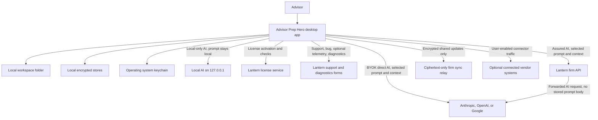

# Advisor Prep Hero Data Flow

This is the plain-English data map for IT review.

## Data Map In Words

1. The advisor chooses a workspace folder on their own computer.
2. The desktop app reads and writes documents in that folder through the local file service.
3. Local app stores, such as audit, mail, search, and vault data, live under the workspace or app data area and use local encryption where implemented.
4. API keys, vault keys, audit keys, mail keys, vector-store keys, firm device keys, and firm matter keys live in the operating system keychain.
5. Local AI mode sends prompt content only to a local loopback service on the same computer.
6. BYOK cloud AI mode sends the user's prompt and selected context directly to the selected AI provider.
7. Firm Assured mode sends the user's prompt and selected context to the Lantern firm proxy, which forwards it to the selected AI provider without storing prompt or completion bodies.
8. Firm shared workspaces send encrypted sync updates to the Lantern relay. The relay sees ciphertext, not readable client text.
9. Optional connectors send or receive data with the vendor the user connected, such as Microsoft, Google, Wealthbox, Salesforce, Redtail, DocuSign, Box, ShareFile, Jotform, Zocks, Addepar, or Calendly.
10. License checks, updates, support, bug reports, optional telemetry, and optional diagnostics contact Lantern service endpoints.

Source trail: [WorkspaceService.ts](../../../src/platform/fs/WorkspaceService.ts), [BackendFactory.ts](../../../src/platform/fs/BackendFactory.ts), [egress.ts](../../../src/platform/privacy/egress.ts), [DataMapDialog.tsx](../../../src/platform/privacy/ui/DataMapDialog.tsx), [fetchUtils.ts](../../../src/platform/providers/fetchUtils.ts), [assuredInference.ts](../../../src/platform/firm/assuredInference.ts), [MatterSyncClient.ts](../../../src/platform/firm/MatterSyncClient.ts), [matterCrypto.ts](../../../src/platform/firm/matterCrypto.ts), [KeychainService.ts](../../../src/platform/providers/KeychainService.ts), [tauri.conf.json](../../../src-tauri/tauri.conf.json), [default.json](../../../src-tauri/capabilities/default.json).

## Mermaid Diagram

## Main Flows

### Local Document Work

Documents stay in the workspace folder chosen by the advisor. The app uses a workspace service and a native file backend to read and write those files. The code also checks vault state before choosing the file backend, so a vault-enabled workspace does not silently fall back to a plain backend.

Source: [WorkspaceService.ts](../../../src/platform/fs/WorkspaceService.ts), [TauriFSBackend.ts](../../../src/platform/fs/TauriFSBackend.ts), [BackendFactory.ts](../../../src/platform/fs/BackendFactory.ts).

### Local AI

If Local-only mode is active, AI generation uses a local model path. The egress logic marks this as local and says data does not leave the machine. A cloud-send guard blocks cloud AI sends when Local-only mode is active or the confidentiality setting is not safely loaded.

Source: [egress.ts](../../../src/platform/privacy/egress.ts), [cloudSendGuard.ts](../../../src/platform/privacy/cloudSendGuard.ts), [providerFactory.ts](../../../src/platform/providers/providerFactory.ts), [OllamaProvider.ts](../../../src/platform/providers/OllamaProvider.ts), [AppLocalProvider.ts](../../../src/platform/providers/AppLocalProvider.ts).

### BYOK Cloud AI

If the advisor chooses Anthropic, OpenAI, or Google, the app sends the prompt and selected context directly to that provider. The request goes from the desktop app to the provider API. The provider receives the content that the user sends.

Source: [fetchUtils.ts](../../../src/platform/providers/fetchUtils.ts), [ClaudeProvider.ts](../../../src/platform/providers/ClaudeProvider.ts), [OpenAIProvider.ts](../../../src/platform/providers/OpenAIProvider.ts), [GeminiProvider.ts](../../../src/platform/providers/GeminiProvider.ts).

### Firm Assured AI

In Assured mode, the app sends the provider-native request to the Lantern firm API. The firm API forwards the request to the selected provider. The backend documentation and code describe this as no-body persistence, with request metadata retained for audit and billing instead of prompt and completion bodies.

Source: [assuredInference.ts](../../../src/platform/firm/assuredInference.ts), [backend README](../../../backend/README.md), [assured.ts](../../../backend/src/routes/assured.ts), [assured.ts lib](../../../backend/src/lib/assured.ts).

### Firm Shared Workspace Sync

For firm shared workspaces, the client encrypts each update before sending it. The relay stores opaque ciphertext and routing metadata. The app decrypts updates locally after pulling them back down.

Source: [MatterSyncClient.ts](../../../src/platform/firm/MatterSyncClient.ts), [matterCrypto.ts](../../../src/platform/firm/matterCrypto.ts), [matterKeyService.ts](../../../src/platform/firm/matterKeyService.ts), [backend README](../../../backend/README.md), [matters.ts](../../../backend/src/routes/matters.ts).

### Support And Diagnostics

The app has endpoints for bug reports, AI setup help, app events, and design-partner diagnostics. These are service paths, not document sync paths. IT can block or separately approve optional diagnostics if needed.

Source: [brand.ts](../../../src/config/brand.ts), [default.json](../../../src-tauri/capabilities/default.json).

## What IT Should Decide

1. Is Local-only mode enough for the first pilot?
2. If cloud AI is allowed, which provider account should the firm use?
3. Should Firm Assured mode be required instead of direct BYOK?
4. Which optional connectors should be approved?
5. Should optional telemetry and diagnostics be disabled for the pilot?
