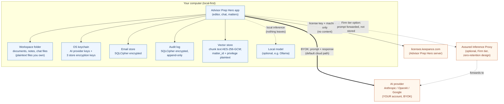

# Advisor Prep Hero security overview

> For a law firm's risk committee, IT, or security reviewer. This describes how Advisor Prep Hero handles confidential client work, in plain English and accurately. Where there is a residual exposure, it is stated plainly rather than glossed over. It is a description of the product as built, not a certification or a legal opinion.

---

## The one-paragraph version

Advisor Prep Hero is a local-first desktop application. Your documents, email, notes, AI chat history, search index, and audit log live in a folder on your own computer, not on Advisor Prep Hero servers. Your AI provider API keys live in your operating system's keychain. When you use a cloud AI model, the prompt goes directly from your machine to the AI provider you chose, under your own account; Advisor Prep Hero is not in that path. The only routine connection Advisor Prep Hero makes to its own servers is a license check (the license key and a machine identifier, never your content). Some on-device stores are additionally encrypted at rest. There is no usage telemetry unless you turn it on.

---

## Architecture: where data lives and moves

**Reading the diagram:**
- Everything in the blue box stays on your computer.
- The thin line to `licenses.keepance.com` carries only a license key and a machine identifier. No documents, prompts, or responses.
- The thick line to the AI provider is the default cloud path: in BYOK mode your prompt goes straight to the provider you chose, under your own account. **This is the one path where your prompt content leaves your device in normal use, and it goes to your provider, not to Advisor Prep Hero.**
- The dotted line to a local model (Ollama) is fully on-device: nothing leaves at all.
- The dotted line to the Assured Inference Proxy is an optional Firm-tier path described at the end; it is a designed architecture, not yet a shipped service.

---

## How each part works

### Local-first storage
Your workspace is a folder you choose on your own disk. Documents and notes are plain files. AI chat conversations are saved as files in that folder too. Advisor Prep Hero reads and writes that folder; it does not sync it to a Advisor Prep Hero server. If you want the folder on iCloud, Dropbox, or a network share, that is your choice and your provider's terms apply; Advisor Prep Hero is not involved.

### API keys in the OS keychain
Your AI provider keys are stored in the operating system's secret store: Keychain on macOS, Credential Manager on Windows, Secret Service on Linux. They are not written to a Advisor Prep Hero server and not stored in plaintext app config. (In a browser-only demo build without a keychain, an encrypted-file fallback is used; the shipping desktop app uses the real OS keychain.)

### BYOK: bring your own key
You supply your own AI provider key. When you send a prompt to a cloud model, the request goes from your machine directly to that provider's API. Advisor Prep Hero servers are not a relay and never see the prompt or the response. The honest implication: **the AI provider does see the prompt you send it**. That is inherent to using any cloud model, and it is governed by your own account terms with that provider (including any zero-data-retention or no-training settings you have enabled). If you need a model that sees nothing off-device, use a local model.

### Local model mode
Advisor Prep Hero can drive a local model (for example via Ollama) running on your own hardware. In this mode the prompt is processed on the device and nothing leaves it. This is the strongest confidentiality posture and the right choice for the most sensitive work.

### Encryption at rest (on-device stores)
Three stores are encrypted at rest on your device, each with its own independent key held in the OS keychain:

- **Email store**: SQLCipher-encrypted database at `<workspace>/.keepance/`, key service `keepance-mail-enc`.
- **Audit log**: separate SQLCipher-encrypted, append-only database at `<workspace>/.keepance/audit-enc.db`, key service `keepance-audit-enc`.
- **Vector store (retrieval index) chunk text**: encrypted with AES-256-GCM (a fresh random 12-byte nonce per value and a 16-byte authentication tag that detects tampering), key service `keepance-vectors-enc`.

The three keys are cryptographically independent: compromising or rotating one does not affect the others.

### Matter isolation
Each client matter is a confidentiality scope. When the AI retrieves from your files to answer a question, the search is restricted to a single matter using a database prefilter that runs **before** the search, not a filter applied after. This is enforced at the data layer, so a query confined to Matter A cannot return Matter B's content. Crossing matters is possible only through an explicit, audited all-matters action.

### Privilege and work-product exclusion
Content can be tagged attorney-client privileged or work-product. By default that material is **excluded from retrieval**: the search predicate is composed as "this matter AND not privileged," so privileged chunks are filtered out before the search runs. Privileged material surfaces only when you make a deliberate, explicit opt-in for that query, which is itself recorded.

### Privileged Matter Mode
When a matter is designated privileged, network-capable extensions (external Model Context Protocol servers and similar integrations that could reach the workspace) are blocked from writing, and every blocked attempt is recorded in the audit log. This is an exfiltration guardrail for your most sensitive matters.

### Audit log as a defense file
Advisor Prep Hero keeps an append-only audit log on your device. Beyond ordinary actions, it records provenance events designed so you can later prove what happened:

- `retrieval_executed`: what was searched, which matter it was confined to, how many results, and the top similarity score (so "nothing relevant was found" is provable).
- `scope_active`: which matter (or the explicit all-matters scope) an AI action ran under, captured at send time.
- `privilege_evaluated`: whether privileged material was excluded (the default) or deliberately included.
- `citation_verified`: whether each cited source actually checks out against your local store, so a misquote or fabricated citation is caught and recorded.
- `egress`: where an AI send actually went (a local model on-device, direct to your provider with your key, or the demo relay) and whether anything left the device.
- `mcp_blocked`: a network extension write that was blocked by Privileged Matter Mode.

The log is for your own oversight and defense and stays on your machine. It is not transmitted to Advisor Prep Hero.

### No telemetry by default
Advisor Prep Hero sends no usage analytics unless you explicitly turn telemetry on. With consent absent, the telemetry path does nothing.

### The single license call
On activation the app calls `licenses.keepance.com` with your license key and a machine identifier, and periodically re-checks to honor revocations. That request contains the license key and machine id only, no documents, prompts, responses, matter names, or other content. Updates are delivered from a public read-only manifest. These two are the only routine outbound connections Advisor Prep Hero itself makes.

---

## Retention map

"Where stored" is on your own device unless stated otherwise.

| Data type | Where stored | Encrypted at rest? | Retention | Who can read it |
|---|---|---|---|---|
| Workspace documents, notes | Your chosen folder (plain files) | No (relies on your full-disk encryption) | Until you delete | You; anyone with device/file access |
| AI chat history | Your chosen folder (files) | No (relies on your full-disk encryption) | Until you delete | You; anyone with device/file access |
| Imported email | `<workspace>/.keepance/` SQLCipher DB | Yes (SQLCipher, key in keychain) | Until you delete | You, via the app; not readable without the key |
| Audit log | `<workspace>/.keepance/audit-enc.db` SQLCipher | Yes (SQLCipher, separate key) | Append-only; until you delete the store | You, via the app; not readable without the key |
| Vector store: chunk text | Local vector DB | Yes (AES-256-GCM, key in keychain) | Until re-indexed or deleted | You, via the app; not readable without the key |
| Vector store: matter_id and privilege labels | Local vector DB | **No (plaintext on purpose, for query)** | Until re-indexed or deleted | Anyone with raw access to the device file |
| AI provider API keys | OS keychain | Yes (OS-managed) | Until you remove them | You / OS account; gated by the OS |
| Prompt + response (BYOK cloud) | Not stored by Advisor Prep Hero; sent to your AI provider | In transit: TLS | Determined by your AI provider account terms | Your AI provider (per your account) |
| Prompt + response (local model) | On device only | n/a (never leaves) | n/a | You |
| License key + machine id | `licenses.keepance.com` | In transit: TLS | Per license-service records | Advisor Prep Hero license service; payment processor (LemonSqueezy) |
| Usage telemetry | Not collected unless you opt in | n/a | n/a unless enabled | n/a unless enabled |
| Prompt + response (Assured Inference Proxy, optional Firm tier) | Transient memory only; designed not to persist | In transit: TLS both legs | None by design (bodies not written) | Provider; the proxy in transient memory only |

---

## Residual risks, stated honestly

A risk committee should weigh these. None is hidden in the marketing.

1. **Cloud AI providers see your prompts (BYOK cloud mode).** This is unavoidable for any product that uses a cloud model, including Advisor Prep Hero. The prompt goes to the provider you chose, under your account and its terms. Mitigations: use a local model for the most sensitive work; enable zero-data-retention / no-training on your provider account; rely on matter isolation and privilege exclusion to control what ever gets into a prompt in the first place.

2. **Plaintext metadata in the vector store.** The chunk text is encrypted, but `matter_id` and the privilege label are stored in plaintext because they must be queryable to enforce isolation before the search runs. Someone with raw access to the device's vector-store file could learn which matters exist and their identifiers, even though they could not read the chunk contents. This is a deliberate trade-off for correct isolation. Mitigation: full-disk encryption on the device.

3. **Plain files are only as protected as the device.** Workspace documents and chat files are plaintext on disk by design (they are your files, in your folder). Their confidentiality depends on your operating-system account security and full-disk encryption. Advisor Prep Hero's at-rest encryption of the email/audit/vector stores supplements this; it does not replace device hardening.

4. **The license/update servers are Advisor Prep Hero-operated.** They are designed to receive no content, but they are still external endpoints. A compromise of the license service would expose license keys and machine identifiers, not client data.

5. **The Assured Inference Proxy is designed, not yet shipped.** The zero-retention proxy below is a de-risked architecture. Do not treat it as a live, audited service until it ships with its independent audit. Until then, the honest answer for "single vendor, no key handling, and nothing exposed to Advisor Prep Hero" is: BYOK direct (your provider sees the prompt, Advisor Prep Hero does not) or a local model (nothing leaves).

6. **Operational security is shared.** Endpoint malware, a compromised OS account, an over-permissioned network extension, or a misconfigured matter membership can defeat application-level controls. Privileged Matter Mode and the audit log reduce but do not eliminate this.

---

## Optional Firm tier: the Assured Inference Proxy (designed, not yet live)

Some firms want one vendor relationship and one invoice instead of each attorney holding provider keys. For them, the Firm tier is designed to offer an optional inference proxy that Advisor Prep Hero operates and that is built to be architecturally incapable of keeping your prompts:

- **Stateless forwarding.** It authenticates a firm seat, attaches the firm's provider credential (held in a secret manager, never logged), streams the request to the provider, and streams the response back. The body is held only in transient memory for the duration of the stream.
- **No write path for bodies.** No prompt, completion, request body, or response body is written to disk, a database, a log, or a trace. The design intent is that this is enforced by the type system and verified by a published test, so the claim can be inspected rather than trusted.
- **Metadata-only logs** (request id, org, seat, provider, model, token counts, latency, status, time): never content, never content hashes.
- **Verifiability** through published data-path source, a CI test asserting no body serialization, an independent audit scoped to the proxy, provider-side zero-data-retention configuration, and a per-request no-retention signal.

The full design rationale is in `spikes/firm-sync/DECISION.md` (section 5). If a firm requires that **no** prompt content ever touch Advisor Prep Hero infrastructure, the proxy is not the answer, BYOK direct or a local model is.

---

## Where to verify these claims

- Encryption at rest: `src-tauri/src/commands/mail/crypto.rs`, `src-tauri/src/commands/audit/crypto.rs`, `src-tauri/src/commands/rag/crypto.rs`, and the corresponding `store.rs` files.
- OS keychain: `src-tauri/src/commands/keychain.rs`.
- Matter isolation and privilege exclusion (prefilter): `src-tauri/src/commands/rag/store.rs`.
- Audit provenance events: `src/types/audit.ts`, `src/modules/audit/AuditService.ts`.
- Egress accounting and data map (in-app): `src/components/privacy/EgressIndicator.tsx`, `src/components/privacy/DataMapDialog.tsx`.
- License call: `src/hooks/useLicense.ts`.
- Telemetry consent gate: `src/utils/telemetry.ts`.
- Assured Inference Proxy design: `spikes/firm-sync/DECISION.md`.

---

*This overview describes the product as built and is kept in sync with the code referenced above. It is not a certification, audit report, or legal advice. For the data processing contract, see `docs/legal/DPA-template.md`. For SOC 2 status, see `docs/trust/soc2-readiness.md`.*
