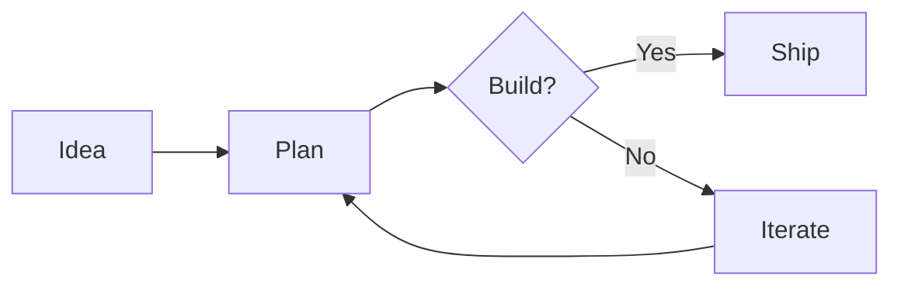

# Mermaid Preview

A Keepance plugin that renders fenced ` ```mermaid ` blocks from your active document into a live diagram preview in the sidebar.

## What it does

- Adds a "Mermaid Preview" sidebar panel.
- Polls the active editor every 1 s, extracts every fenced mermaid code block, and renders each one as an SVG inside the panel.
- Adds a "Refresh" toolbar button (icon: `workflow`) and the command `mermaid-preview.refresh` for manual refresh.
- Shows a friendly empty state with a code sample when the document has no mermaid blocks.

## Permissions

| Permission | Why |
|---|---|
| `editor:selection` | Required to read the active editor's content via `api.editor.getContent()`. v2.0 uses this permission as the gate for both selection access and full content reads. |

The plugin worker declares no `network` permission. Mermaid itself is loaded inside the sidebar iframe from a CDN (the iframe context is allowed to fetch by the host CSP), not by the worker.

## How rendering works

Plugin code runs in a Web Worker, which has no DOM. Mermaid needs a DOM to render. So this plugin extracts diagram source from the editor in the worker, then embeds each diagram as a `<pre class="mermaid">` block inside the sidebar iframe HTML. The iframe loads mermaid 11.x from `cdn.jsdelivr.net` via a `<script type="module">` tag and renders each pre into SVG inside the iframe.

If your install runs offline and you need self-contained rendering, swap the CDN URL in `src/index.ts` for a self-hosted copy of mermaid.

## Build

```bash
npm install
npm run build
```

Output: `dist/index.js` (single-file IIFE bundle, lightweight because mermaid is not bundled).

## Sideload

Copy `manifest.json` and `dist/index.js` into your local Keepance plugins folder, then enable under Settings -> Plugins:

| OS | Path |
|---|---|
| Windows | `%APPDATA%/Keepance/plugins/mermaid-preview/` |
| macOS | `~/Library/Application Support/Keepance/plugins/mermaid-preview/` |
| Linux | `~/.local/share/Keepance/plugins/mermaid-preview/` |

## Try it

Paste this into a Keepance document:

````markdown

````

Open the Mermaid Preview panel in the sidebar. The diagram renders within a second.

## Screenshot

> TODO: replace with a real screenshot of a rendered mermaid diagram in the sidebar panel.

## License

MIT
